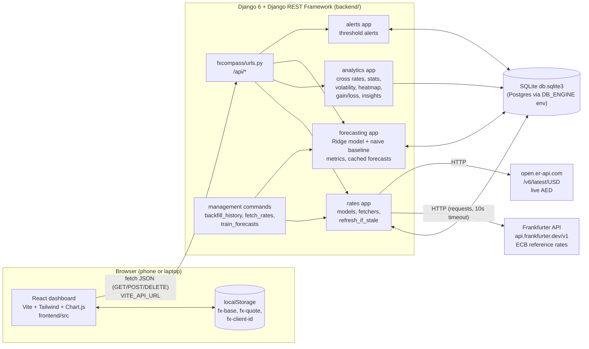

# Architecture

> Draft for team review. Facts below are taken from the code as of 2026-10-05.

FX Compass is a single-page React dashboard backed by a Django REST API. The browser **only** talks to our Django API; Django is the only part that talks to the outside world (two free exchange-rate APIs). Everything is cached in a SQLite database, so the dashboard keeps working when the external APIs are down.

## System diagram

## Frontend (`frontend/`)

- **React 19 + Vite 8**, styled with **Tailwind CSS 4**, charts with **Chart.js 4** through `react-chartjs-2`.
- One page: `src/pages/Dashboard.jsx`. It lays out ten widgets from `src/components/`: `Header`, `Converter`, `HistoryChart`, `Forecast`, `GainLoss`, `LiveRates`, `Volatility`, `Alerts`, `Heatmap`, `Footer`.
- **One network client**: `src/api/client.js` builds every request from `VITE_API_URL` (default `http://localhost:8000/api`). `src/api/useApi.js` is a small hook that fetches a path with parameters and re-fetches when they change. No other file calls `fetch`.
- **Layout**: one column on phones; on large screens (`lg:`) a 3-column grid (main widgets in 2 columns, rates/volatility/alerts in 1, heatmap full width).
- **State kept in the browser** (`localStorage`): the chosen base and quote currency (`fx-base`, `fx-quote`) and an anonymous random id for alerts (`fx-client-id`). If storage is blocked, the app still works with defaults.
- **Answer first**: every widget is a `Card` (`src/components/ui.jsx`) that shows the server's `insight` sentence *above* the chart.
- Charts use a category x-axis (one label per trading day), so weekends simply don't appear instead of drawing fake flat lines.

## Backend (`backend/`)

Django project `fxcompass` with four apps. All views are function views with DRF's `@api_view`, return JSON only, and need no login (`AllowAny`, no authentication classes).

| App | Responsibility | Key files |
|---|---|---|
| `rates` | Currency list, stored daily rates, fetch log; HTTP clients for Frankfurter and open.er-api; storing and refreshing | `models.py`, `sources.py`, `services.py`, `constants.py`, `management/commands/` |
| `analytics` | Loads all rates into pandas, builds any cross rate, computes conversion, history stats, gain/loss, volatility, heatmap, and writes the one-line insight | `series.py`, `services.py`, `text.py`, `params.py` |
| `forecasting` | Feature engineering, time-based split, Ridge regression, naive baseline, metrics; caches results per pair and data date | `model.py`, `services.py`, `models.py`, `management/commands/train_forecasts.py` |
| `alerts` | Create/list/delete "above/below" alerts per anonymous client id; evaluates them against the latest daily rate | `models.py`, `serializers.py`, `services.py`, `views.py` |

Configuration is read from the root `.env` (via `python-dotenv`): secret key, debug flag, allowed hosts, CORS origins, database engine, API URLs, history start date and refresh interval. See `.env.example`.

## Database

SQLite file `backend/db.sqlite3` by default; setting `DB_ENGINE=postgres` plus `DB_*` variables switches to PostgreSQL with no code change (no SQLite-only features are used). Six tables of our own: `Currency`, `Rate`, `FetchLog`, `ModelMetric`, `Forecast`, `Alert`. Details and ER diagram: [DATABASE.md](DATABASE.md).

Key design choice: **every rate is stored once, against EUR** (`per_eur` = how many units of a currency 1 EUR buys on that date). Any pair is computed on the fly: `quote per base = per_eur[quote] / per_eur[base]`. This is why the base currency is freely selectable. Rates are stored as `Decimal(20,10)`; analytics converts them to floats in pandas and rounds only for display.

## ML (`backend/forecasting/`)

- scikit-learn pipeline `StandardScaler → Ridge(alpha=10)`, one model per horizon (1 to 7 trading days ahead), trained per currency pair on the last 5 years.
- Always compared with the **naive baseline** "the rate stays the same".
- Results (forecast points and test metrics) are stored in `Forecast` and `ModelMetric`, keyed by `(base, quote, data_until, horizon)`. The first `/api/forecast` request for a pair trains it (~0.1 s); later requests read from the DB until a new rate day arrives. `train_forecasts` pre-trains all 90 pairs.
- Full write-up: [MODEL_REPORT.md](MODEL_REPORT.md).

## Data flow

### 1. Getting data in

1. `backfill_history` (run once) calls `rates.services.refresh(full=True)`: downloads every ECB business day since `HISTORY_START` (2018-01-01) from Frankfurter in one request, then fetches today's AED from open.er-api.com.
2. For each day, `store_ecb_days` upserts EUR = 1, the 8 other ECB currencies, and **AED derived from the USD peg** (`per_eur[AED] = per_eur[USD] × 3.6725`, source `derived_peg`).
3. `update_aed_live` then overwrites AED on the latest stored date with `open.er-api AED-per-USD × ECB USD-per-EUR` (source `er_api`).
4. Each attempt is recorded in `FetchLog` (ok/failed, rows, latest date, error message).

### 2. Keeping data fresh (no scheduler)

There is no cron or Celery. Every `GET /api/rates/latest` call runs `refresh_if_stale()` first: if the last ECB fetch attempt is older than `REFRESH_AFTER_HOURS` (6 h), or older than 15 minutes after a **failed** attempt, it fetches from the last stored date to today. Errors are logged and swallowed, so the request still answers from cached data. `fetch_rates` does the same refresh by hand.

### 3. Serving a widget

1. The React widget calls e.g. `GET /api/convert?base=USD&quote=INR&amount=1000`.
2. `analytics/params.py` validates the parameters (400 on bad input).
3. `analytics/series.load_frames()` reads all `Rate` rows into two pandas tables (values and sources), one row per trading day and one column per currency.
4. The service computes the numbers **and** the insight sentence server-side, so the numbers and the words that explain them come from one place.
5. The widget shows the insight, then the chart/stats. Non-ECB values get a small "derived" or "live" badge.

### 4. Alerts

The browser sends its anonymous `client_id` with every alert call. When alerts are created or listed, `alerts.services.evaluate` compares each untriggered alert with the latest daily rate of its pair and stamps `triggered_at / triggered_rate / triggered_on` once it is crossed. Alerts are therefore checked when the dashboard is opened, not pushed in the background.

## Deployment shape (current)

Local development only: `manage.py runserver` on port 8000 and `npm run dev` on port 5173 (CORS allows `localhost:5173`). `npm run build` produces static files in `frontend/dist` that could be served by any static host; no production deployment has been set up.
