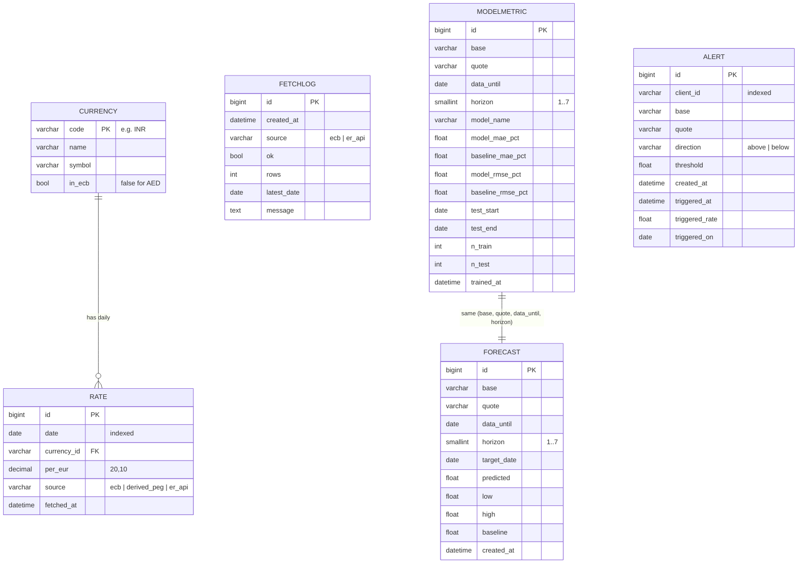

# Database

> Draft for team review. Schema taken from the Django models in `backend/*/models.py`; row counts from the local database on 2026-10-05.

- **Engine:** SQLite (`backend/db.sqlite3`) by default. Set `DB_ENGINE=postgres` and `DB_NAME / DB_USER / DB_PASSWORD / DB_HOST / DB_PORT` in `.env` to use PostgreSQL. No SQLite-specific features are used.
- **Migrations:** `rates/0001`, `forecasting/0001`, `alerts/0001`. Create the tables with `python manage.py migrate`.
- Django also creates its standard tables (`auth_*`, `django_session`, `django_admin_log`, `django_content_type`, `django_migrations`). We don't use logins; these exist only because the Django admin is enabled.
- Table names in the DB are `<app>_<model>`, e.g. `rates_rate`.

## Schema

### `rates_currency` — the 10 supported currencies

| Column | Type | Notes |
|---|---|---|
| `code` | varchar(3) | **Primary key**, e.g. `INR` |
| `name` | varchar(64) | e.g. `Indian Rupee` |
| `symbol` | varchar(8) | e.g. `₹` |
| `in_ecb` | bool | `False` only for AED (the ECB does not publish it) |

Filled automatically from `rates/constants.py` by `ensure_currencies()` on every refresh.

### `rates_rate` — one daily reference rate per currency per day

| Column | Type | Notes |
|---|---|---|
| `id` | bigint | Primary key (auto) |
| `date` | date | Indexed. ECB business days only, weekends/holidays have no row |
| `currency_id` | varchar(3) | **FK → `rates_currency.code`** (cascade delete) |
| `per_eur` | decimal(20,10) | Units of this currency that 1 EUR buys. EUR itself is stored as 1 |
| `source` | varchar(16) | `ecb` (Frankfurter), `derived_peg` (AED from the USD peg), `er_api` (live AED) |
| `fetched_at` | datetime | Updated on every upsert |

Constraint `unique_rate_per_day` on (`date`, `currency_id`), so re-fetching a day updates it instead of duplicating it.

Cross rates are not stored. `1 BASE = per_eur[QUOTE] / per_eur[BASE] QUOTE`, computed in `analytics/series.py`.

### `rates_fetchlog` — every attempt to call an external API

| Column | Type | Notes |
|---|---|---|
| `id` | bigint | Primary key |
| `created_at` | datetime | When the attempt happened. Default ordering: newest first |
| `source` | varchar(16) | `ecb` or `er_api` |
| `ok` | bool | Did it succeed? |
| `rows` | int | Days stored (ECB) or 1 (AED) |
| `latest_date` | date, nullable | Latest rate date received |
| `message` | text | Error text on failure; provider update time for AED |

Drives "last updated", the stale-data banner (`/api/status`) and the 6 h / 15 min refresh rule.

### `forecasting_modelmetric` — test-set scores of the model vs the naive baseline

| Column | Type | Notes |
|---|---|---|
| `id` | bigint | Primary key |
| `base`, `quote` | varchar(3) | Currency pair (plain codes, no FK) |
| `data_until` | date | Last rate date the model saw |
| `horizon` | smallint ≥ 0 | Trading days ahead (1–7) |
| `model_name` | varchar(64) | `Ridge(lagged returns)` |
| `model_mae_pct`, `baseline_mae_pct` | float | Mean absolute error, % of the rate |
| `model_rmse_pct`, `baseline_rmse_pct` | float | Root mean squared error, % of the rate |
| `test_start`, `test_end` | date | Test period |
| `n_train`, `n_test` | int | Number of training / test samples |
| `trained_at` | datetime | Last time this row was written |

Constraint `unique_metric` on (`base`, `quote`, `data_until`, `horizon`).

### `forecasting_forecast` — cached forecast points

| Column | Type | Notes |
|---|---|---|
| `id` | bigint | Primary key |
| `base`, `quote` | varchar(3) | Currency pair |
| `data_until` | date | Last rate date used |
| `horizon` | smallint | 1–7 |
| `target_date` | date | Mon–Fri business day being forecast (ECB holidays not excluded) |
| `predicted` | float | Model forecast |
| `low`, `high` | float | 80% range: 10th / 90th percentile of past test errors applied to the prediction |
| `baseline` | float | Naive forecast = last known rate |
| `created_at` | datetime | |

Constraint `unique_forecast` on (`base`, `quote`, `data_until`, `horizon`). Default ordering by `horizon`.

### `alerts_alert` — threshold alerts

| Column | Type | Notes |
|---|---|---|
| `id` | bigint | Primary key |
| `client_id` | varchar(64) | Indexed. Anonymous random id from the browser's localStorage (8–64 chars) |
| `base`, `quote` | varchar(3) | Pair, validated against the 10 codes; must differ |
| `direction` | varchar(5) | `above` or `below` |
| `threshold` | float | 0 ≤ threshold ≤ 1e9 |
| `created_at` | datetime | Default ordering: newest first |
| `triggered_at` | datetime, nullable | Set once, when the alert is first found crossed |
| `triggered_rate` | float, nullable | Rate at that moment |
| `triggered_on` | date, nullable | Rate date that crossed the threshold |

"Above" means `rate > threshold`; "below" means `rate < threshold` (strict).

## ER diagram

Only `RATE → CURRENCY` is a real foreign key. `ModelMetric`, `Forecast` and `Alert` store currency codes as plain text (validated in code against the 10 codes), and `ModelMetric`/`Forecast` are linked logically by their shared unique key, not by a foreign key. `FetchLog` stands alone.

## What's in the local database (2026-10-05)

| Table | Rows | Detail |
|---|---|---|
| `rates_rate` | 22,410 | 2,241 trading days, 2018-01-02 → 2026-10-02 |
| | 20,169 `ecb` | 9 currencies × 2,241 days (EUR=1 included) |
| | 2,240 `derived_peg` | AED for every day except the latest |
| | 1 `er_api` | AED on the latest day (2026-10-02) |
| `forecasting_modelmetric` | 630 | 90 pairs × 7 horizons, `data_until` = 2026-10-02 |
| `forecasting_forecast` | 630 | same |
| `rates_fetchlog` | 12 | all recent attempts successful |
| `alerts_alert` | 0 | |

The database file is git-ignored; each team member builds their own with `migrate` + `backfill_history`.
