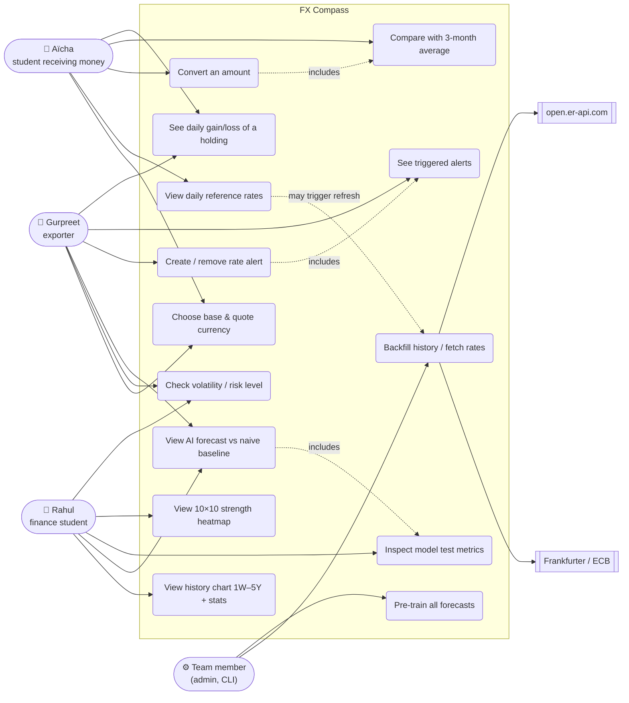
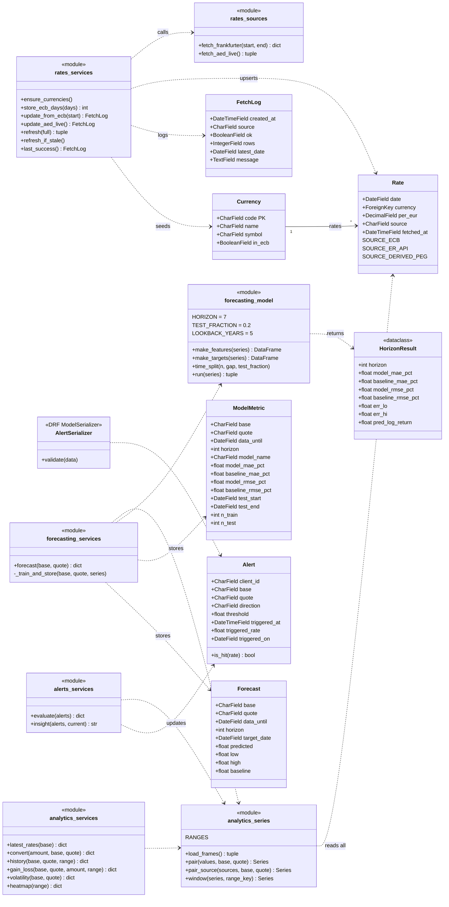
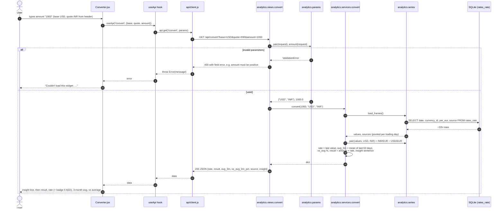
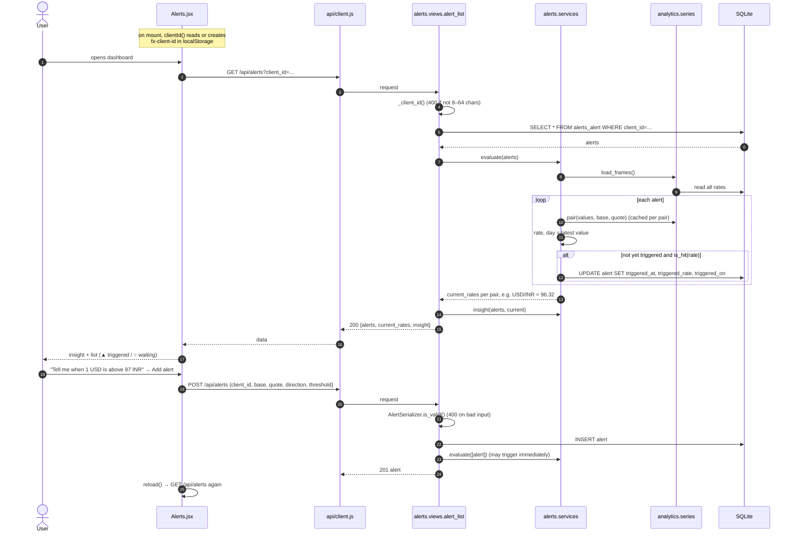
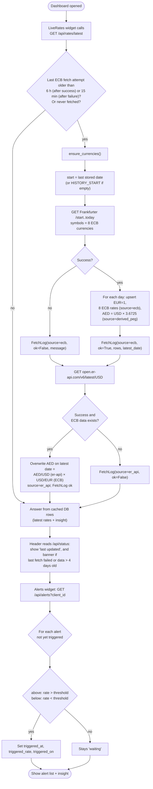

# UML diagrams

> Draft for team review. Diagrams are drawn from the actual code (`backend/` and `frontend/src/`). GitHub renders the Mermaid blocks directly.

## 1. Use case diagram

Mermaid has no native use-case diagram, so this is drawn as a flowchart: actors on the left, use cases (rounded) in the system boundary, external systems on the right.

## 2. Class diagram

Django models (persisted) plus the main service modules (plain Python modules, drawn as classes with their public functions).

## 3. Sequence diagram: "user converts currency"

Aïcha types 1000 USD → INR in the Converter.

## 4. Sequence diagram: "alert check"

Alerts are checked when they are created and whenever the dashboard lists them (on page load). There is no background worker.

## 5. Activity diagram: "daily fetch + alert check"

What happens from a dashboard request to updated data and alert states. The refresh is triggered by `GET /api/rates/latest` (or by running `fetch_rates` by hand); the alert check happens when the Alerts widget loads.

